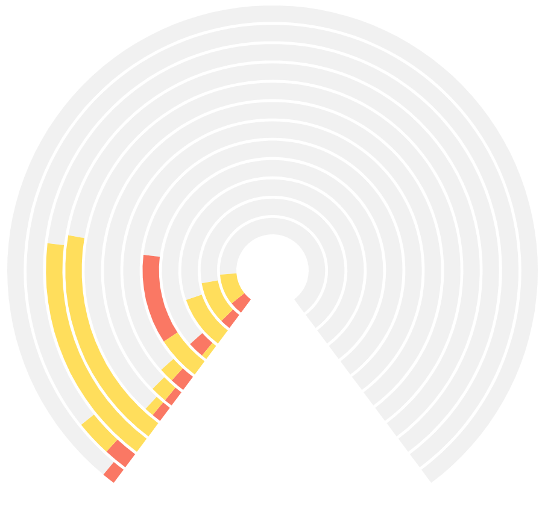

# Circular Bar Chart Mod for Spotfire®

The Circular Bar Chart Mod for Spotfire® is a custom visualization built using Vega specifications. This mod provides a unique way to visualize categorical data in a circular format, offering an alternative to traditional bar charts by arranging the bars in a radial layout.



## Getting Started

**Mod Sample:** A sample of this mod can be tried in Spotfire® Analyst.

### How to Open the Mod

1. Open Spotfire® Analyst and create a new analysis by loading some data.
2. Unzip the downloaded mod file and locate the `.mod` file.
3. Drag the `.mod` file into the analysis. The visualization mod will be added to your analysis.

**Capabilities and Limitations:** For details on the capabilities and limitations of this visualization mod, [refer to the Spotfire documentation](https://docs.tibco.com/pub/sfire-analyst/latest/doc/html/en-US/TIB_sfire-analyst_UsersGuide/index.htm#t=modvis%2Fmodvis_how_to_use_a_visualization_mod.htm).

## Data Requirements

To render the circular bar chart correctly, the following data structure is required:

- **X-Axis:** X-axis contains the categorical variable that defines the bars.
- **Y-Axis:** Y-axis contains the numeric value to be displayed on the chart.
- **Colors:** An additional category for color representation.

Sample Data

| Channel | Type    | Value |
|---------|---------|-------|
| 1       | wifi    | 12    |
| 1       | nonWifi | 5     |
| 1       | free    | 83    |
| 2       | wifi    | 7     |
| 2       | nonWifi | 14    |
| 2       | free    | 79    |
| 3       | wifi    | 2     |
| 3       | nonWifi | 2     |
| 3       | free    | 96    |
| 4       | wifi    | 2     |
| 4       | nonWifi | 1     |
| 4       | free    | 97    |
| 5       | wifi    | 1     |
| 5       | nonWifi | 1     |
| 5       | free    | 98    |
| 6       | wifi    | 22    |
| 6       | nonWifi | 0     |
| 6       | free    | 78    |
| 7       | wifi    | 21    |
| 7       | nonWifi | 0     |
| 7       | free    | 79    |
| 8       | wifi    | 3     |
| 8       | nonWifi | 2     |
| 8       | free    | 95    |
| 9       | wifi    | 0     |
| 9       | nonWifi | 1     |
| 9       | free    | 99    |
| 10      | wifi    | 12    |
| 10      | nonWifi | 3     |
| 10      | free    | 85    |
| 11      | wifi    | 12    |
| 11      | nonWifi | 0     |
| 11      | free    | 88    |
| 12      | wifi    | 1     |
| 12      | nonWifi | 3     |
| 12      | free    | 96    |

## Setting Up the Circular Bar Chart

The mod includes several configuration options:

- **Start Angle (Default: -2.5):** The starting angle for the bars.
- **End Angle (Default: 2.5):** The ending angle for the bars.
- **Pad Angle (Default: 0):** The padding angle between bars.
- **Band Padding (Default: 0.15):** The padding between bands.
- **Inner Radius (Default: 60):** The inner radius of the chart.
- **Corner Radius (Default: 0):** The corner radius of the bars.
- **Offset (Default: "zero"):** The offset for the bars.

## Using the Circular Bar Chart

After configuring the mod, it will render a circular bar chart where each bar represents a category, arranged radially.

### Marking

- Supports marking of bar segments.
- Click a bar segment to mark it.
- Use CTRL-Click to add/remove segments from marking.
- Click in any open area to clear the marking.

## Building the Project

To build the project, run the following commands in separate terminal windows:

```bash
npm install
npm start
```